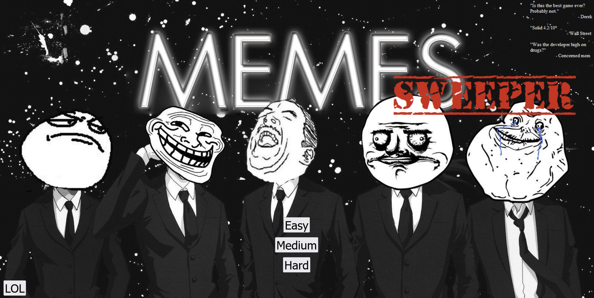

# Minesweeper

## Timeframe
  * 1 week

## Technologies & Tools used
  * HTML
  * CSS
  * Javascript
  * Github

## Description
This is a classic Minesweeper game with 3 different difficulty levels. The game was developed using HTML, CSS and Javascript during my time as a student of the Software Engineering Immersive course at General Assembly.

Prior to this project, I had not played Minesweeper before. While browsing through a list of possible games, I stumbled upon Minesweeper and was immediately hooked. The game can be challenging yet addictive.

To cater to the cool players, I developed a twist to the vanilla game. By incorporating popular internet memes, this game hopes to bring out the MemeLord in everyone.

## How To Play
In this puzzle video game, the player starts with a board divided into cells. Mines are randomly distributed across the cells. Each cell has 3 different states: covered, uncovered and flagged. Covered cells are blank and clickable, while uncovered cells are informative and cannot be interacted with. Flagged cells denote where the player suspects a bomb might be located. To prevent unintentional exposure of potential mined cells, flagged cells are unclickable until they are unflagged. 

The game begins when the player selects a covered cell on the board. If the player clicks on a mined cell, the game ends with a loss.
Otherwise, the uncovered cell reveals a number. Each number corresponds to the number of mines located diagonally and adjacent to the cell. The objective of the game is to uncover all the unmined cells without exposing any mined cell. 

## Game Architecture
To emulate the game, I had to understand the different components of Minesweeper. After playing the game multiple times, I deconstructed the game into several important rules and components.

I used the MVC approach for this game, utilising an array as a model representation for the board. Each square/tile is represented by an element in the array, with different values correlating to varying functions.

# User Stories
| As a User, when I                        |  This happens                
| :--------------------------------------- |:-----------------------------------------------|
| Click on selected difficulty             |  See a covered board with varying number of squares
| Click on a square                        |  The square will display either a number, an empty square, or a bomb
| Right-click                              |  To flag the square. Flagged cells denote where the player suspects a bomb might be located. To prevent unintentional exposure of potential mined cells, flagged cells are unclickable until they are unflagged.
| Click on a mined square                  |  The game ends with a lost, with a game over prompt. 
| Click on an empty square                 |  All adjacent empty squares will be revealed, and all numbered squares adjacent to those will be displayed as well.
| Click on a numbered square               |  Only that square will be revealed.
| See a number                             |  Corresponds to the number of mines located diagonally and adjacent to the cell. 
| Click on reset button                    |  Resets the board at the selected difficulty
| Click on home button                     |  Returns to the start screen.

## Step-By-Step Approach
Using pseudocode, I broke the process down into several main components.
  * Part 1: Design the blank board
  * Part 2: Generate the bombs in random cells
  * Part 3: Implement 'search' function for each cell
  * Part 4: Implement 'flood' function for each cell
  * Part 5: Design multiple difficulty levels

## Key Learning Points
  1. Through the project, I learnt and implemented recursive functions.
  2. It is important to always take a step back and plan the project as a whole before jumping into it. As this was my first project, I was eager to start on the Javascript code without a properly crafted wireframe and user story. When I decided to upscale my game
     to include several difficulty levels, I had to revise chunks of my code to accomodate more variables and functions.

## Future Development
As this was a course project for submission, there would unlikely be further changes made. However, if there were, possible improvements could include: 
  - Adding more Memes

## Game Resource Acknowledgement
Resources used in this project do not belong to me. All rights belong to the original artists and owners.
  - [Audio files](https://www.myinstants.com/en/index/sg/)
  - Background Images (links used in JS files)